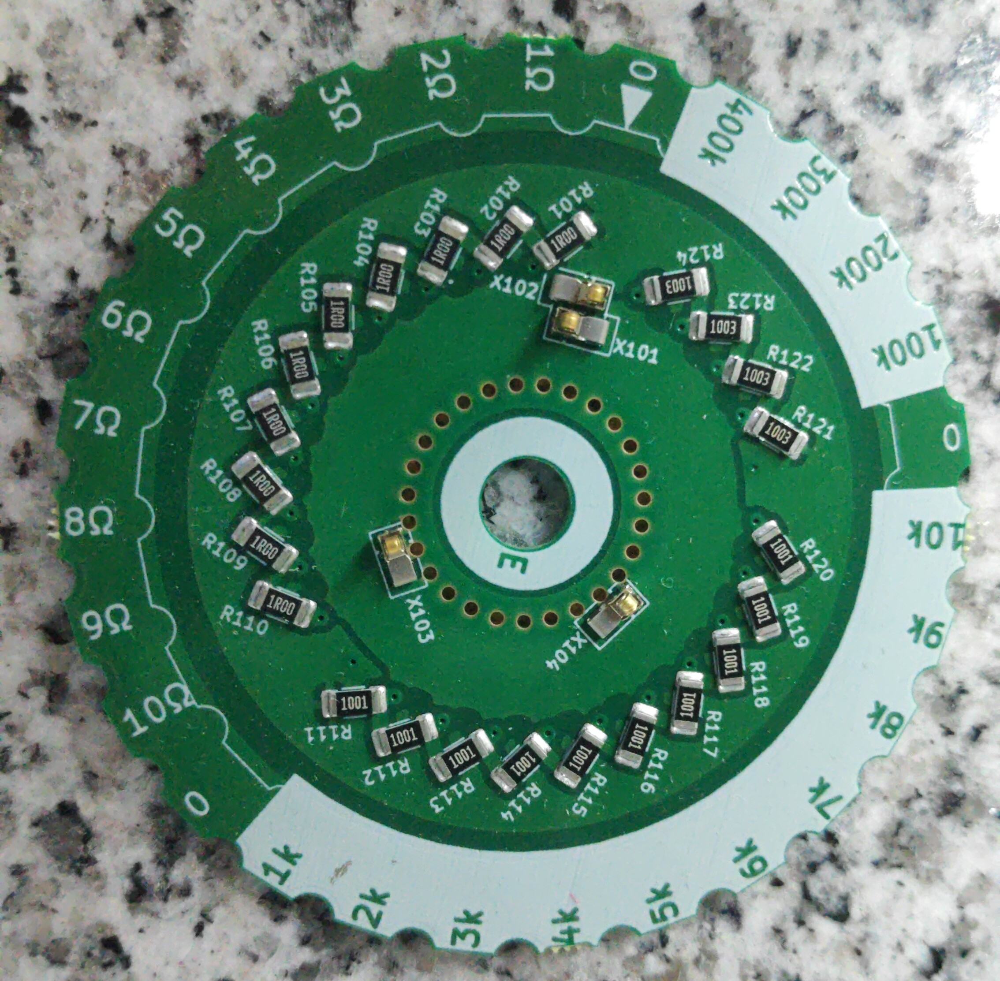
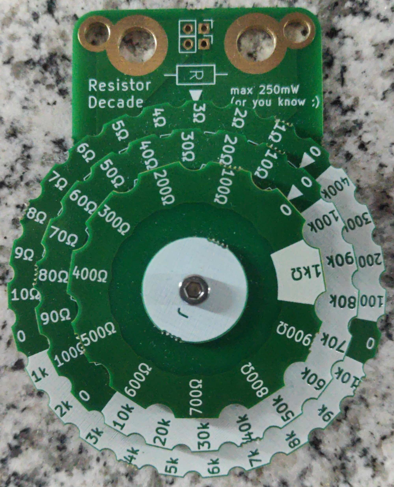

# ResistorDecade

Das Originalprojekt ist hier zu finden: [https://www.dekimo.com/resistor-decade/]()

Das Projekt ist veröffentlicht unter der Lizenz: [CC-BY-SA](https://creativecommons.org/licenses/by-sa/4.0/)

## Bestücken
### 12x Harwin S727145R

Hier sieht man wie die Federn platziert werden müssen:

### 10x 1kΩ

### 4x 100kΩ

### 10x 10kΩ

### 10x 100Ω

### 10x 10Ω

### 10x 1Ω

## Zusammenbau

Die Anleitung zum Zusammenabauen ist auf Platine B aufgedruckt.

## Fertig
